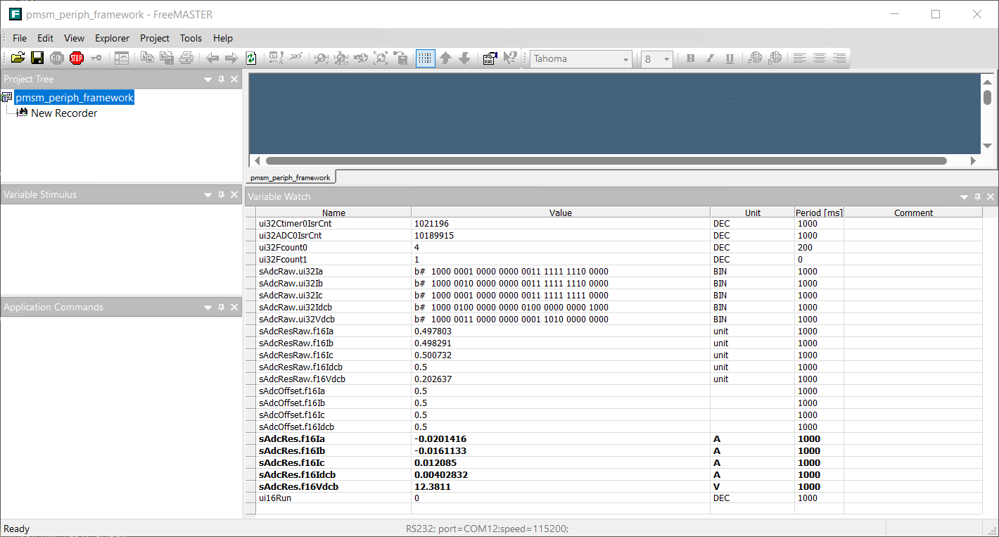

# NXP Application Code Hub
[](https://www.nxp.com)

## LPC553x Motor control application framework

Motor control framework was done according to customer requirements for simple and easy to use example to build more complex solutions. In this example there is prepared almost everything  for running 3-phase voltage inverter based applications. There are no additional API for important peripherals, everything is done at low level. There are prepared two interrupts, ADC sampling, FreeMASTER and RTCESL libraries implementations. **This example as is, is not prepared to spin the motor. It is cornerstone to develop an application which will be able to spin the motor.** More details are here in [Application overview](#step5).


#### Boards: LPCXpresso55S36
#### Categories: Motor Control
#### Peripherals: ADC, CLOCKS, GPIO, PWM, TIMER, UART
#### Toolchains: MCUXpresso IDE

## Table of Contents
1. [Software](#step1)
2. [Hardware](#step2)
3. [Setup](#step3)
4. [Results](#step4)
5. [Application overview](#step5) 
6. [FAQs](#step6) 
7. [Support](#step7)
8. [Release Notes](#step8)

## 1. Software<a name="step1"></a>
* Latest [MCUXpresso IDE](https://www.nxp.com/design/design-center/software/development-software/mcuxpresso-software-and-tools-/mcuxpresso-integrated-development-environment-ide:MCUXpresso-IDE)
* LPC55S36 SDK including FreeMASTER (Downloadable via MCUXpresso IDE)
* [FreeMASTER realtime debugger](https://www.nxp.com/design/design-center/software/development-software/freemaster-run-time-debugging-tool:FREEMASTER)

## 2. Hardware<a name="step2"></a>
* [LPCXpresso55S36 Development Board](https://www.nxp.com/design/design-center/software/development-software/mcuxpresso-software-and-tools-/lpcxpresso-boards/lpcxpresso55s36-development-board:LPCXpresso55S36)


* [FRDM-MC-LVPMSM](https://www.nxp.com/design/design-center/development-boards/general-purpose-mcus/nxp-freedom-development-platform-for-low-voltage-3-phase-pmsm-motor-control:FRDM-MC-LVPMSM)


* Power supply adapter 24-48 VDC

## 3. Setup<a name="step3"></a>
For running the example software there is needed to insert FRDM-MC-LVPMSM to the LPCXpresso55S36 board. Without FRDM-MC-LVPMSM the SW will work but the analog measurement by ADC will not give correct numbers because of missing voltage offset from power stage. You could debug the SW within IDE and/or FreeMASTER. 

### 3.1 Step 1
Import the project into the MCUXpresso IDE.

### 3.1 Step 2
Add FreeMASTER into the project by right click on project and go to SDK management/Manage SDK components.
Ensure that FreeMASTER is checked in Middleware. Click OK and it will include all nescessary FreeMASTER files into the project.

*Note: There is nescessary to have preinstalled target device SDK package with FreeMASTER*

### 3.1 Step 3
On the top of main.c set ENABLE_FREEMASTER	to 1.

### 3.2 Step 4

Build and flash the project into LPCXpresso55S36 board.

### 3.2 Step 5

Run FreeMASTER .pmpx project from **motor_control** folder and connect to board.


In some cases is necessary to plug out/in EVK USB after flashing or after computer wake up from sleep. After code modification, FreeMASTER pup-ups changes to accept in MAP file.




## 4. Results<a name="step4"></a>
You could observe live analogue values and correct measurement of DC-bus voltage according to connected power supply level to FRDM-MC-LVPMSM board. After set the `ui16Run` to 1, there should be obvious that calibration procedure correctly detected and subtracted offset on current channels.

## 5. Application Overview<a name="step5"></a>
### 5.1 Peripherals initialization
Initialization functions are located in **mc_periph_init.c** source file.
### 5.2 Ports and pins 
There is example of two initialization approaches. Both uses PinTool but in different way. Basic pin initialization uses **BOARD_Init_Pins** function from **board/pin_mux.c** source file generated by the tool. Alternative way how to initialize pins is to export register values (as defines) and place them manually into registers. This approach looks much cleaner in code but it requires more user knowledge of MCU registers and manual placement of generated values.

### 5.3 PWM
There is used **eFlexPWM** module to drive 3-phase Voltage Source Inverter. PWM frequency is configured in **peripheral_init.h.** file by setting `PWM_FREQ` define. 
From this frequency value there is calculated by preprocessor `PWM_MODULO` value for eFlexPWM module.  
PWM is configured to run in symmetric, center-aligned mode. This is done by setting `INIT` register value to `-MODULO/2` and `VAL1` register value to `MODULO/2 – 1`. 
Deadtime value register DTCNTn is configured based on `M1_PWM_DEADTIME`. 
`VAL4` register is used as trigger event for ADC to sample shunt resistors voltage drops during zero vector (all bottom switches are ON). Trigger-out for ADC is enabled in `PWM_TCTRL_OUT_TRIG_EN` register.


### 5.4 ADC
ADC0 module is initialized in the framework. After enabling of clock there is used default calibration function. In most cases the user want to update or adjust channel sample sequence. For this purpose there were prepared additional supportive defines which helps to understand command configuration of this kind of ADC.

#### 5.4.1 ADC commands
The main misunderstanding of low level coding of command sequence is numbering offset of actual and next command by configuring CMDL and CMDH registers. For this purpose there were defined actual commands (ACT_CMDx) and next commands (NEXT_CMDy) in **lpc55s36_lowlevel_adc.h**.
By using them the low level configuration is more clear for user because numbering offset is masked by the name of defines. Additional defines were created to express configuration parameters according to reference manual, see lpc55s36_lowlevel_adc.h
```
ADC0->CMD[ACT_CMD1].CMDL =  ADC_CMDL_ADCH(3U)
                        |   ADC_CMDL_CTYPE(CMDL_CTYPE_DUAL_SINGLE_AB)
                        |   ADC_CMDL_MODE(CMDL_MODE_STANDARD)
                        |   ADC_CMDL_ALTB_ADCH(0U)
                        |   ADC_CMDL_ALTBEN(0);

ADC0->CMD[ACT_CMD1].CMDH =  ADC_CMDH_CMPEN(0)
                        |   ADC_CMDH_WAIT_TRIG(0)
                        |   ADC_CMDH_LWI(0)
                        |   ADC_CMDH_STS(CMDH_SAMPLETIME_3_5)
                        |   ADC_CMDH_AVGS(CMDH_AVERAGE_1)
                        |   ADC_CMDH_LOOP(0)
                        |   ADC_CMDH_NEXT(NEXT_CMD2);

```
#### 5.4.2 ADC FIFO
The important part initialization is FIFO configuration. There is field in trigger control register `ADC_TCTRL_FIFO_SEL_A` and `SEL_B`. This field sets the destination of ADC results of A,B channels to FIFO 0,1.

`ADC_TCTRL_FIFO_SEL_A`register indicates the FIFO to which SAR results are written for Channel A. This field provides the destination for A,B-side single-ended and differential conversions and also for all A-side conversions in dual single-ended mode.

`ADC_TCTRL_FIFO_SEL_B` register indicates the FIFO to which SAR results are written for Channel B. This field is only used in dual single-ended mode. In this mode, the SAR result from Channel B is written to the FIFO number specified by this field.

This is important to know how many results will be in result FIFOs. For this purpose there is also necessary to set right watermark for ADC interrupt.
There is recommended to read number of results in FIFOs (before reading the FIFOs) and compare them with expected number of configured conversions.

#### 5.4.3 HSCMP
High Speed Comparator is set to continuous mode. MSEL mux is set do internal 8-bit DAC. PSEL mux is set to channel 3 which is in our case DC-bus current. HSCMP output is routed as fault into eFlexPWM module.

#### 5.4.4 CTIMER
Ctimer 0 is used as slow loop (1kHz) periodic timer with interrupt.

#### 5.4.5 INPUTMUX
This mux allows to route signals between peripherals. In project it is configured by using Pins Tool. Routed signal is displayed as n/a pin.


### 5.5 ADC results handling

In the example for better understanding of ADC capabilities, the ADC results are stored into 32-bit variables to observe additional status bits. 32-bit results are then masked with `ADC_RESFIFO_D_MASK` and stored into 16-bit variables. For particular results there is subtracted an offset and used RTCESL shift to full 16-bit scale.
ADC results are stored and conditioned in `AdcGetResults()` function.  

### 5.6 Application scaling
ADC results are scaled in function `ScaleValues()`. Results are scaled and converted into float by using `MLIB_ConvSc_FLTsf` function e.g.:
````
sMotor.fltVdcb = MLIB_ConvSc_FLTsf(sMotor.f16Vdcb, fltDcBusVoltageScale);
````

There is used required fractional (integer) ADC result as input and float constant which defines full HW scale of e.g. DC-bus voltage.

### 5.7 Application state machine

Application state machine is realized as array of pointers to this application state functions.
````
typedef void (*tPointerFcn)(void); /* pointer to function */

static tPointerFcn AppStateMachineFast[] = {AppInitFast,AppStopFast,AppStartFast,AppRunFast,AppErrorFast};
````
There are two state machines calls in **main.c** source code:
`AppStateMachineSlow` in CTIMER ISR (slow loop)
`AppStateMachineFast` in ADC ISR (fast loop)

Particular state machine functions are placed in **motor_control.c**, most of them are empty excluding INIT, STOP and RUN state of fast loop. State is controlled and indicated by variable `ui8MotorState` which is used for both state machines. Change of the state variable is strictly done in transition functions. 
Transition functions are not part of the array pointers, they are independent and easy to rewrite and update according to required user transitions.

In INIT state of fast loop there is example of variables initialization. In stop state of fast loop, the application is waiting for `ui16Run > 0` condition. Then it goes through transition to START state.
START state is intended for e.g. alignment purposes goes to RUN according to state diagram.


## 6. FAQs<a name="step6"></a>
No FAQs have been identified for this project.

## 7. Support<a name="step7"></a>


#### Project Metadata
<!----- Boards ----->
[](https://github.com/search?q=org%3Anxp-appcodehub+LPCXpresso55S36+in%3Areadme&type=Repositories)

<!----- Categories ----->
[](https://github.com/search?q=org%3Anxp-appcodehub+motor_control+in%3Areadme&type=Repositories)

<!----- Peripherals ----->
[](https://github.com/search?q=org%3Anxp-appcodehub+adc+in%3Areadme&type=Repositories) [](https://github.com/search?q=org%3Anxp-appcodehub+clocks+in%3Areadme&type=Repositories) [](https://github.com/search?q=org%3Anxp-appcodehub+gpio+in%3Areadme&type=Repositories) [](https://github.com/search?q=org%3Anxp-appcodehub+pwm+in%3Areadme&type=Repositories) [](https://github.com/search?q=org%3Anxp-appcodehub+timer+in%3Areadme&type=Repositories) [](https://github.com/search?q=org%3Anxp-appcodehub+uart+in%3Areadme&type=Repositories)

<!----- Toolchains ----->
[](https://github.com/search?q=org%3Anxp-appcodehub+mcux+in%3Areadme&type=Repositories)

Questions regarding the content/correctness of this example can be entered as Issues within this GitHub repository.

>**Warning**: For more general technical questions regarding NXP Microcontrollers and the difference in expected functionality, enter your questions on the [NXP Community Forum](https://community.nxp.com/)

[](https://www.youtube.com/@NXP_Semiconductors)
[](https://www.linkedin.com/company/nxp-semiconductors)
[](https://www.facebook.com/nxpsemi/)
[](https://twitter.com/NXP)

## 8. Release Notes<a name="step8"></a>
| Version | Description / Update                           | Date                        |
|:-------:|------------------------------------------------|----------------------------:|
| 1.0     | Initial release on Application Code Hub        | June 18<sup>th</sup> 2024 |
| 1.1     | Readme update, clock config clean up        | June 28<sup>th</sup> 2024 |
| 1.2     | Readme PWM picture fix        | Feb 4<sup>th</sup> 2025 |

